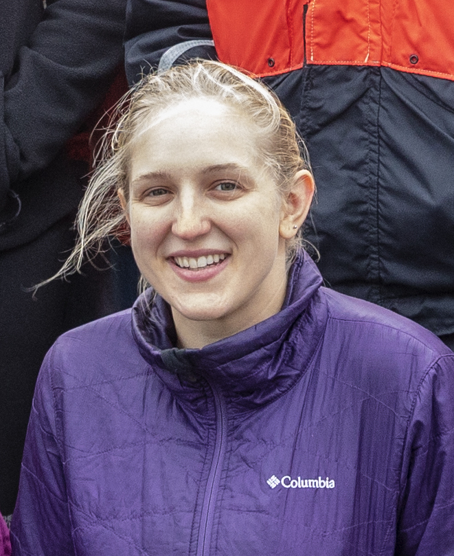

```{r setup, include=FALSE}
# don't show code unless we explicitly set echo = TRUE
knitr::opts_chunk$set(echo = FALSE)
require(here)
```
{width=25%}

## Postdoctoral Associate, Cornell University

I am an ecologist interested in population dynamics and life history evolution. In particular, I study how observed population fluctuations are influenced by reproductive traits and early life history events. In my doctoral thesis work, I focused on the distribution, growth, and transport of larval fishes. My thesis included chapters about [tropical tuna spawning](https://www.nature.com/articles/s41598-019-47161-0) in the Phoenix Islands Protected Area (central tropical Pacific), [Atlantic bluefin tuna spawning](https://www.whoi.edu/oceanus/feature/the-secret-tuna-nursery/) in the Slope Sea, and a trait-based approach to studying coral reef fish dispersal. I also worked on the evolutionary demography of [maternal effect senescence](https://www.pnas.org/content/117/28/16431), a particular class of maternal effects that we studied using data from a novel model organism.

I am currently a postdoctoral associate at Cornell University in the department of Ecology and Evolutionary Biology. I am working on two meta-analyses using the [compadre and comadre](https://compadre-db.org/) databases, which archive published matrix population models from plants and animals, respectively. I am analyzing matrices from these databases using new tools from the fANOVA class of analyses--- in essence, these new methods are exact versions of existing approximation tools for analyzing sensitivity and decomposing variance in population dynamics and individual life history outcomes. My postdoctoral work is in collaboration with and supervised by [Steve Ellner](http://www.eeb.cornell.edu/Ellner/) (Cornell), [Giles Hooker](http://faculty.bscb.cornell.edu/~hooker/) (Cornell), [Robin Snyder](https://case.edu/artsci/biol/snyder/snyder.html) (Case Western Reserve), and [Peter Adler](https://qcnr.usu.edu/labs/adler_lab/index) (Utah State).


