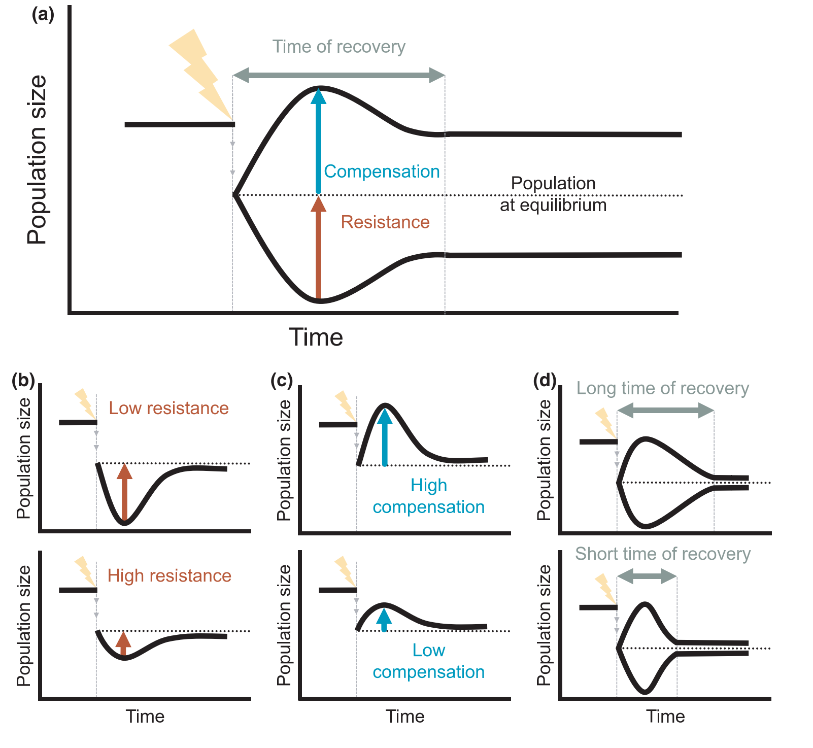
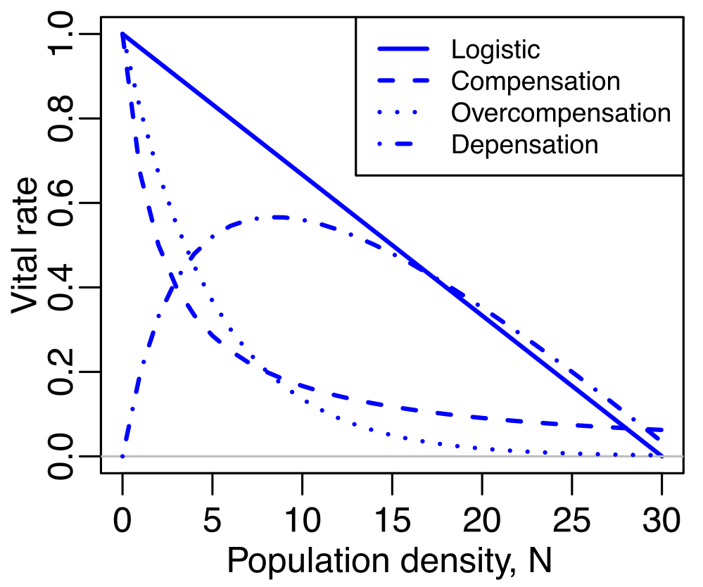
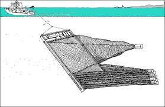

```{r setup, include=FALSE}
# don't show code unless we explicitly set echo = TRUE
knitr::opts_chunk$set(echo = FALSE)
require(here)
```

My research covers a range of topics related to reproductive and early life history stages, and ranging from field- and laboratory-based investigations to mathematical ecology and biological-physical marine dispersal simulations. Many of these threads have implications for harvested or otherwise managed populations. Please read on for more detailed descriptions of a few major areas of my research.

# **Population Dynamics**

<br>

## Background: Structured population models
Structured population models are widely used by ecologists, for species ranging from viruses to trees to whales. These models work in *discrete time* and are primarily *linear models*, meaning that the models are fit to census data collected at fixed intervals, and that they assume the population is in a constant environment. Structured population models can be **matrix population models** (MPMs) or **integral projection models** (IPMs). MPMs utilize discrete ages, stages, or size bins to structure the population, while IPMs are structured by a continuous variable, most often size. IPMs often work well when there is an expected smooth functional relationship between size and survival or fertility, and can be powerful for smaller datasets. Although they are built using different methods, the resulting MPM or IPM can generally be analyzed using a lot of the same techniques.

The MPM or IPM can be used to project the population forwards in time:

The population at time $t$ is expressed as the number or density of individuals in each of the size, age, or stage classes, arranged into a vector $\mathbf{n}_t$. This can be multiplied by the projection matrix $\mathbf{A}$ to yield the population vector at the next time, $t+1$:

\begin{equation}
\mathbf{n}_{t+1} = \mathbf{A}*\mathbf{n}_t
\end{equation}

The matrix itself, for example, could look like: 
\begin{equation}
\mathbf{A}_1 = 
\begin{bmatrix}
f_1       & f_2    & f_3 \\
s_1       & 0      & 0 \\ 
0         & s_2    & s_3 \\
\end{bmatrix}
\end{equation}
This example might apply to an age-classified population where individuals of age 3 and older are indistinguishable. The first row contains the fertility rate of each age class, and the sub-diagonal contains the survival rate.

From these matrix models, we can estimate the stable population size and structure, the population growth rate, and a whole host of other individual- or population-level metrics. These models are built from demographic data from different populations, time spans, or experimental treatments. 

<br>

## Life Table Response Experiments
A common question to ask is how the population growth rate varies amongst multiple models for the same species, and how that variation depends on the changes in the entries of the matrix (the vital rates: survival, growth, and fecundity). In this way, we are decomposing the change in population growth rate into the contributions from each of the vital rates. 

I built on the long-standing approximation method for this decomposition, called a Life Table Response Experiment (LTRE), to generate an [exact version of LTRE](https://besjournals.onlinelibrary.wiley.com/doi/full/10.1111/2041-210X.14065), which can take into account not only the first-order effects of the vital rates, but also the effects of interactions amongst the vital rates. This exact method, which is available as an [R package](https://cran.r-project.org/web/packages/exactLTRE/index.html), can be used to more precisely study the population dynamics of any species. To learn more about this work, you can watch this [webinar on the package](https://www.youtube.com/watch?v=PEjqJHotUTM&list=PL4ADF7CAA34DD8E4D&index=72&ab_channel=MethodsEcolEvol).

To demonstrate the utility of this tool, I am performing a comparative study of matrix population models from two publicly available databases. In this study, I am investigating patterns in the dependence of population dynamics on changes in the survival vs. fertility rates, and whether these patterns interact with life histories (e.g., the fast-slow continuum).

<br>

## Population Resilience
My newest project, funded by NERC's Pushing the Frontiers program, seeks to expand the existing framework for analysis of population resilience to (1) more realistic disturbance regimes; (2) models with density-dependent population regulation; and (3) across hierarchical levels, *i.e.*, from individuals to populations to communities.

{width=75%}
<br>
This existing framework assumes that the disturbance takes the form of a single 'pulse': essentially a one-time change to the population structure, that then decays away with time. However, real populations will be exposed to a variety of disturbances with different return times, or to 'press' disturbances that cause a permanent change in a given vital rate. I will be involved in developing and implementing novel mathematical approaches to combine concepts of stochastic environments with the transient dynamics analyses that underpin the existing resilience framework ([Capdevila et al. 2022](https://doi.org/10.1111/ele.14004)).

<br>
I will also be examining how the existing framework can be applied to non-linear population models, specifically models that incorporate density dependence. The standard structured population models assume that the parameters of the model-- the vital rates describing survival, growth, and reproduction-- are constant even when population size changes. However, real populations can exhibit a variety of different relationships between their vital rates and population density, and these density-dependent effects can vary in their stage-specificity as well.

{width=50%}

<br>
Finally, I will work on extending our framework for analyzing demographic resilience within populations to analyzing the resilience of multi-species communities. More on this as the project progresses!

<br>

## Luck in life histories
In structured population models, all individuals that share the same state (age, class, size) also share the same probabilities of surviving, growing, shrinking, and reproducing. From the perspective of the model, they are identical. However, if we use that model to simulate a series of individuals, they will follow wildly different life courses: some will die in the first time step, some will live long enough to reproduce once, and a small percentage will survive a long time and produce many offspring.

The study of luck or 'individual stochasticity' in demographic models is motivated by the frequent observation of high levels of reproductive skew in populations: a small number of adults contribute the majority of the offspring (and, therefore, population growth). 

I have examined the role of 'luck' in life histories across the wide variety of plant and animal population models available through the [COM(P)ADRE databases](compadre-db.org). I have found that, when no other phenotypic variation is represented in the models, that variance in lifespan and variance in lifetime reproductive output (LRO) are positively related. That is, populations with a lot of variation in lifespan (either because the population has a long mean lifespan, or because of high mortality in early life followed by low mortality) *also* show a lot of variation in LRO. However, skewness in lifetime reproductive output was negatively correlated to variance in LRO. As variance in LRO increases, the distribution becomes wider but less skewed. Finally, we found positive relationships between variance in LRO and both longevity and population growth rate. High variance in LRO may expose populations to harmful genetic drift, and we would expect that to be an issue in recovering populations of long-lived iteroparous species.

The manuscript on this work is in revision as of October 2023.

<br>

# **Maternal effects in rotifers**
{width=30%}

<br>
For many species, there is significant variation in individual fitness that can be attributed to maternal effects. Early life survival is strongly influenced by maternal provisioning (e.g., egg mass), particularly for species without post-natal care. Maternal health, body condition, and stress can lead to differences in survival or even phenotypic changes in the offspring. In rotifers, we observe a decline in the survival and fertility of offspring with increasing age of their mothers, a phenomenon known as maternal effect senescence. This is observed even in clonal populations, with no post-natal care, and no evidence of changes in maternal provisioning.

I have a productive collaboration studying maternal effects in rotifers with matrix population models. Using individual life history data from a laboratory population of rotifers, I found that maternal effect senescence was expressed mostly as decreased fertility, and that it can arise through decreasing selection gradients with age. This paper is [available open-access.](https://www.pnas.org/content/117/28/16431)

I have also collaborated on a project investigating how [maternal age influences lifetime reproductive output](https://www.journals.uchicago.edu/doi/full/10.1086/718716) and have an ongoing collaboration looking at how these observed maternal effects respond to caloric restriction treatments.

<br>

# **Tuna larvae**
Tuna are fascinating creatures: the adults are highly migratory and have evolved a number of features for optimized swimming, hunting, and thermal regulation. For example, when they want to do fast burst swimming (for example during hunting), they can fold their dorsal fin down into a slot in the top of their body.

Their larvae hatch at just 2-3 mm in length, and grow rapidly. By about 1-2 weeks of age, these larvae are hunting down other fish larvae with their big eyes and big mouths.

{width=50%}

<br>
Tuna are important as a source of food and they are prized by sport fishers. Like many species of fish, tuna exhibit high adult fecundity and high mortality in the early life stages. This means that small changes in early life growth and survival can have big impacts on the population dynamics and, by extension, on our decisions about how many fish to catch each year.

<br>

## Phoenix Islands Protected Area
In addition to the important role that early life stages play in driving population dynamics, studying larvae can be an important way to gain insight into adult presence and spawning behavior in places where the adults cannot be studied. For example, in the Phoenix Islands Protected Area (PIPA), in the Republic of Kiribati, there is no commercial fishing allowed. 

I was part of a project where we established a monitoring program of tuna larvae (skipjack, yellowfin, and bigeye) in PIPA. I analyzed larval tuna distribution as well as age and growth, finding no difference in growth between an El Niño year (2015) and a neutral year (2016). I also used particle backtracking simulations to demonstrate that spawning is occurring by tropical tunas both inside and to the northeast of PIPA.


<br>
Because of the huge contribution of tuna fishing to the economy of Kiribati, it is important to know if the protected area might also be protecting tunas. As our time series grows over the next few years, we hope to be able to ask questions about the influence of PIPA on spawning adults and larval tunas.

This paper is [available open-access.](https://www.nature.com/articles/s41598-019-47161-0)

<br>

## Atlantic bluefin tuna
Traditionally, it has been understood that Atlantic bluefin tuna exhibit strong natal homing, and that they reproduce in two locations: the Gulf of Mexico and the Mediterranean Sea. However, it has long been speculated that another spawning area might exist in the Western Atlantic, north of the Gulf of Mexico. In 2013, 67 bluefin larvae were collected in a region off the US East Coast known as the Slope Sea - it is the wedge of ocean extending from Cape Hatteras to the northeast, as the Gulf Stream peels away from the shelf break. These larval collections prompted debates over whether the area should be considered a "third" spawning ground.

{width=50%}

<br>
I set out to investigate whether the Slope Sea represented suitable larval habitat. Using samples collected by NOAA scientists in 2016, I found that larval growth rates did not differ between the Slope Sea and the Gulf of Mexico that year, and that in fact Slope Sea larvae were slightly larger than Gulf of Mexico larvae at the time of hatching. I also demonstrated, using both backward and forward tracking simulations, that the larvae were spawned in the Slope Sea, and that they would be retained in the region until 25 days old, when they become capable of directed swimming. This work demonstrates that, at least in 2016, the Slope Sea was providing suitable larval habitat. Additional simulation work carried out in collaboration with physical ocenaographer Irina Rypina has shown that the Slope Sea provided ample suitable habitat for spawning and larval growth throughout the summer, at least over the past 10 years.

<br>

# **Larval dispersal**
Dispersal is a crucial life history event that influences the dynamics of local and meta-populations as well as invasion and evolutionary processes. While organisms in terrestrial systems often exhibit adaptations to increase their dispersal, aquatic and marine systems tend to be highly dispersive and adaptations are expected to arise to restrict transport in ocean currents. Two major traits related to dispersal in fish larvae are the pelagic larval duration and the vertical positioning of individuals. Pelagic larval duration sets the scope of maximum dispersal distance based on transport in ocean currents, and vertical positioning is important because wind-driven ocean currents decay with depth. In particular, it has been shown in some locations that a downward shift as larvae grow (a phenomenon termed ontogenetic vertical migration or OVM) can constrain dispersal and help larvae get back to shore.



<br>
Using data from two years of monthly surveys across the Straits of Florida, I analyzed the vertical distributions of 23 taxa of coral reef fish larvae, finding behaviors that fit into several broad categories: surface-associated taxa, taxa that exhibit OVM, and messier patterns. These messier patterns include broadening depth preference with age, a complete lack of depth preference, and a shift towards shallower waters with age.

In larval simulations inspired by these vertical patterns, I found that a species exhibiting an even distribution across the water column experiences similar dispersal as a species exhibiting OVM. Both of these behaviors, even distribution and OVM, had more constrained dispersal and less connectivity in general across the Caribbean region. However, these patterns were more complex on regional and local scales, where the influence of local hydrography and habitat availability helped determine the dispersal and connectivity.

This paper is published at [Coral Reefs](https://link.springer.com/article/10.1007/s00338-023-02355-x). Please get in touch if you cannot access it.

